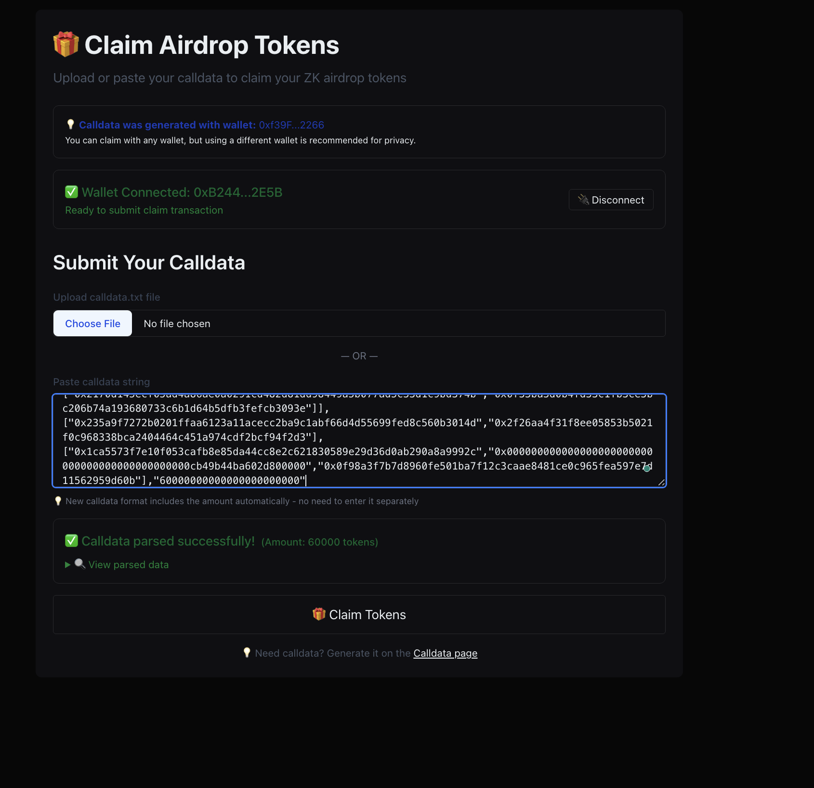

# ZK Token Distributor - Visual Documentation

This folder contains screenshots and visual resources for the ZK Token Distributor project, demonstrating the complete user flow from initial access to token claiming.

## Application Screenshots

### 1. Initial Access & Authentication

#### Home Page (Unauthenticated)


The initial landing page showing the ZK Token Distributor interface before wallet connection.

#### Sign-In with Ethereum (SIWE)


The authentication flow using Sign-In with Ethereum for secure wallet connection.

#### Home Page (No Claim/proof Available)


State when no valid proof can be generated for the current wallet address.
The home page state when the user is authenticated but no claim is available.

### 2. Proof Generation & Claiming

#### Proof Generation Success


Successful generation of zero-knowledge proof with calldata ready for claiming tokens.

#### Claim Submission


The claiming interface showing transaction submission in progress.

#### Claim Failure (Duplicate)


Error state when attempting to claim tokens that have already been claimed (nullifier already used).

### 3. Dashboard & Token Management

#### Dashboard (Before Claim)


User dashboard showing zero token balance before any claims have been made.

#### Dashboard (After Successful Claim)


User dashboard displaying token balance after successful claim transaction.

## User Flow Summary

1. **Access** → User visits the application without wallet connection
2. **Authenticate** → User connects wallet using Sign-In with Ethereum (SIWE)
3. **Generate Proof** → System generates ZK proof if user is eligible for tokens
4. **Claim Tokens** → User submits claim transaction using generated calldata
5. **Verify Success** → Transaction confirmation and redirect to dashboard
6. **View Balance** → Dashboard shows updated token balance

## Technical Features Demonstrated

- **Zero-Knowledge Proofs**: Privacy-preserving eligibility verification
- **SIWE Authentication**: Secure wallet-based authentication
- **Smart Contract Integration**: Ethereum blockchain interaction
- **Transaction Status Tracking**: Real-time transaction monitoring
- **Error Handling**: Comprehensive error states and user feedback
- **Responsive Design**: Mobile-friendly interface

## Usage in Documentation

Reference these screenshots in documentation using:
```markdown

```
